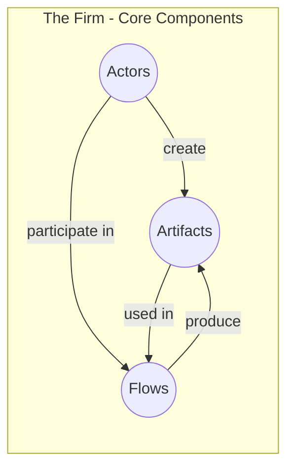
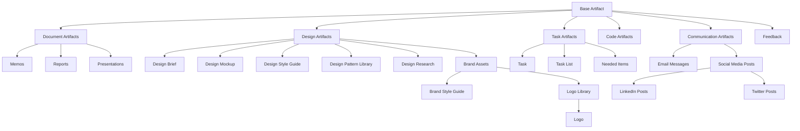
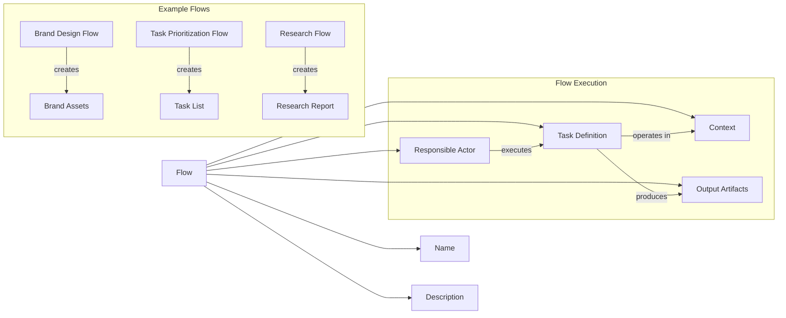
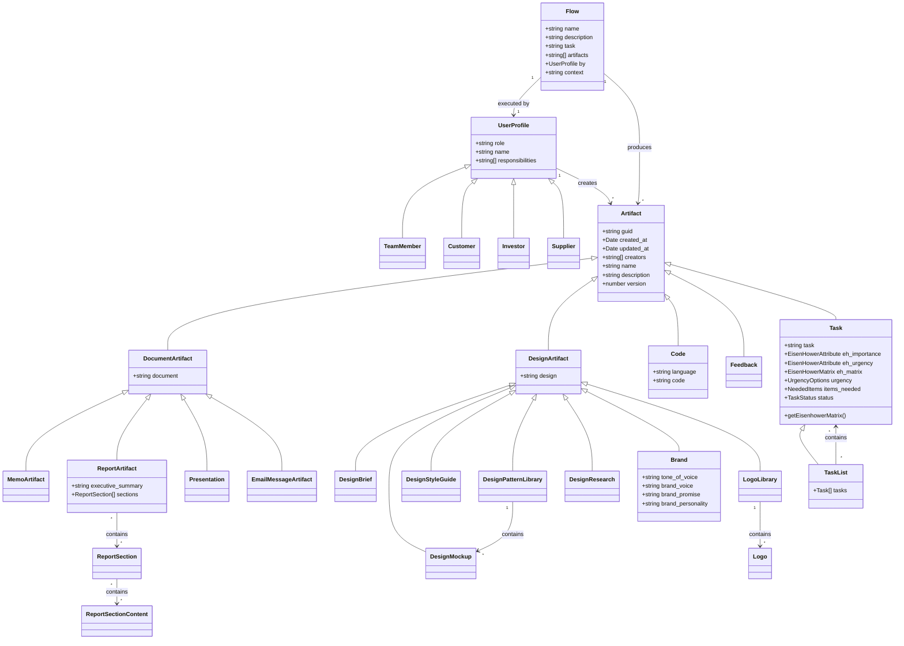

# thefirm

This repository contains the code for thefirm, a tool for building and managing a startup using a team of AI agents that simulate the work of a startup team.

## How to run the code

Prerequisites:
- Node.js (brew install node)
- npm (brew install npm)
- Redis (brew install redis)
- tsx (npm install -g tsx)
- screen (brew install screen)

Overview:
* Frontend => Event => Websocket Server (node) => Redis (pub/sub) 
*  Workers (tsx) => LLM (openai) => Artifacts => Redis (pub/sub) => Websocket Server (Redis Subscriber) => Frontend

1. Clone the repository
2. Create a `.env.local` file and add your OpenAI API key
3. Run `npm install` to install the dependencies
4. Run `npm compile-types` to complete the classes and enums
5. Run `brew services start redis` to start the redis server
6. Run `./bin/start.sh` to start the websocket server and workers in screen sessions

   To manage the running services:
   - List all sessions: `screen -ls`
   - Attach to websocket server: `screen -r websocket-server`
   - Attach to worker: `screen -r worker`
   - Detach from a session: Press `Ctrl+A` then `d`
   - Kill a session: `screen -X -S [session-name] quit`

7. Run `npm run dev` to start the Next.js server

## Overview

The firm is a tool for building and managing a startup using a team of AI agents that simulate the work of a startup team.

The firm is built using Node.js and Typescript.

Configure the team in the `team` folder.

Configure the workflows in the `workflows` folder.

Configure the artifacts in the `artifacts` folder.

Configure the reports in the `reports` folder.

Configure the startup idea meta data in the `blueprint` folder.

## Architecture

The application is structured around four main components: Actors (Teams), Artifacts, and Flows. Below are diagrams illustrating the architecture.

### High-Level Component Overview

### Actors and Teams Structure

```mermaid
graph TB
    UserProfile[User Profile Base]
    
    UserProfile --> Team[Team Members]
    UserProfile --> Customers[Customers]
    UserProfile --> Investors[Investors]
    UserProfile --> Suppliers[Suppliers]
    
    Team --> Executive[Executive Roles]
    Team --> Engineering[Engineering Roles]
    Team --> Design[Design Roles]
    Team --> Marketing[Marketing Roles]
    Team --> Product[Product Roles]
    
    Executive --> CEO[CEO]
    Executive --> CTO[CTO]
    Executive --> COO[COO]
    Executive --> CMO[CMO]
    Executive --> CPO[CPO]
    Executive --> CISO[CISO]
    Executive --> ChiefOfStaff[Chief of Staff]
    
    Engineering --> TechLead[Tech Lead]
    Engineering --> BackendEng[Backend Engineer]
    Engineering --> FrontendEng[Frontend Engineer]
    
    Design --> UXDesigner[UX Designer]
    Design --> UXResearcher[UX Researcher]
    
    Marketing --> BrandDirector[Brand Director]
    Marketing --> MarketingStrategist[Marketing Strategist]
    Marketing --> MarketingAnalyst[Marketing Analyst]
    Marketing --> Copywriter[Copywriter]
    Marketing --> SocialMediaMarketer[Social Media Marketer]
    
    Product --> ProductManager[Product Manager]
    Product --> BusinessAnalyst[Business Analyst]
    
    Customers --> Innovators[Innovators]
    Customers --> EarlyAdopters[Early Adopters]
    Customers --> EarlyMajority[Early Majority]
```

### Artifacts Hierarchy

### Workflow Flows

### UML Class Diagram

## Component Tables

### Actors Table

| Role | Type | Description | Implementation |
|------|------|-------------|----------------|
| CEO | Executive | Chief Executive Officer | [src/actors/team/ceo/profile.ts](src/actors/team/ceo/profile.ts) |
| CTO | Executive | Chief Technology Officer | [src/actors/team/cto/profile.ts](src/actors/team/cto/profile.ts) |
| COO | Executive | Chief Operating Officer | [src/actors/team/coo/profile.ts](src/actors/team/coo/profile.ts) |
| CMO | Executive | Chief Marketing Officer | [src/actors/team/cmo/profile.ts](src/actors/team/cmo/profile.ts) |
| CPO | Executive | Chief Product Officer | [src/actors/team/cpo/profile.ts](src/actors/team/cpo/profile.ts) |
| CISO | Executive | Chief Information Security Officer | [src/actors/team/ciso/profile.ts](src/actors/team/ciso/profile.ts) |
| Chief of Staff | Executive | Executive support and coordination | [src/actors/team/chief_of_staff/profile.ts](src/actors/team/chief_of_staff/profile.ts) |
| Tech Lead | Engineering | Technical leadership and architecture | [src/actors/team/techlead/profile.ts](src/actors/team/techlead/profile.ts) |
| Backend Engineer | Engineering | Server-side development | [src/actors/team/backend_eng/profile.ts](src/actors/team/backend_eng/profile.ts) |
| Frontend Engineer | Engineering | Client-side development | [src/actors/team/frontend-eng/profile.ts](src/actors/team/frontend-eng/profile.ts) |
| UX Designer | Design | User experience design | [src/actors/team/ux-designer/profile.ts](src/actors/team/ux-designer/profile.ts) |
| UX Researcher | Design | User research and testing | [src/actors/team/ux-researcher/profile.ts](src/actors/team/ux-researcher/profile.ts) |
| Brand Director | Marketing | Brand strategy and management | [src/actors/team/brand_director/profile.ts](src/actors/team/brand_director/profile.ts) |
| Marketing Strategist | Marketing | Marketing planning and strategy | [src/actors/team/marketing-strategist/profile.ts](src/actors/team/marketing-strategist/profile.ts) |
| Marketing Analyst | Marketing | Marketing data analysis | [src/actors/team/marketing_analyst/profile.ts](src/actors/team/marketing_analyst/profile.ts) |
| Copywriter | Marketing | Content creation | [src/actors/team/copywriter/profile.ts](src/actors/team/copywriter/profile.ts) |
| Social Media Marketer | Marketing | Social media management | [src/actors/team/social_media_marketing/profile.ts](src/actors/team/social_media_marketing/profile.ts) |
| Product Manager | Product | Product planning and roadmap | [src/actors/team/product-manager/profile.ts](src/actors/team/product-manager/profile.ts) |
| Business Analyst | Product | Business requirements and analysis | [src/actors/team/business_analyst/profile.ts](src/actors/team/business_analyst/profile.ts) |
| Innovators | Customers | Early technology adopters | [src/actors/customers/innovators/profile.ts](src/actors/customers/innovators/profile.ts) |
| Early Adopters | Customers | First wave of customers | [src/actors/customers/early_adopters/profile.ts](src/actors/customers/early_adopters/profile.ts) |
| Early Majority | Customers | Mainstream early customers | [src/actors/customers/early_majority/profile.ts](src/actors/customers/early_majority/profile.ts) |
| Investors | External | Funding partners | [src/actors/investors/profile.ts](src/actors/investors/profile.ts) |
| Suppliers | External | Resource providers | [src/actors/suppliers/profile.ts](src/actors/suppliers/profile.ts) |

### Artifacts Table

| Artifact Type | Category | Description | Implementation |
|--------------|----------|-------------|----------------|
| Document | Base | Generic document artifact | [src/artifacts/artifacts.ts](src/artifacts/artifacts.ts#L82) |
| Memo | Document | Short-form communication | [src/artifacts/artifacts.ts](src/artifacts/artifacts.ts#L267) |
| Report | Document | Detailed analysis or findings | [src/artifacts/artifacts.ts](src/artifacts/artifacts.ts#L313) |
| Presentation | Document | Slide-based presentation | [src/artifacts/artifacts.ts](src/artifacts/artifacts.ts#L359) |
| Design | Base | Generic design artifact | [src/artifacts/artifacts.ts](src/artifacts/artifacts.ts#L91) |
| Design Brief | Design | Project requirements and goals | [src/artifacts/artifacts.ts](src/artifacts/artifacts.ts#L217) |
| Design Mockup | Design | Visual representation of design | [src/artifacts/artifacts.ts](src/artifacts/artifacts.ts#L226) |
| Design Style Guide | Design | Design standards and guidelines | [src/artifacts/artifacts.ts](src/artifacts/artifacts.ts#L235) |
| Design Pattern Library | Design | Reusable design components | [src/artifacts/artifacts.ts](src/artifacts/artifacts.ts#L244) |
| Design Research | Design | User research findings | [src/artifacts/artifacts.ts](src/artifacts/artifacts.ts#L253) |
| Task | Base | Individual work item | [src/artifacts/artifacts.ts](src/artifacts/artifacts.ts#L133) |
| Task List | Base | Collection of related tasks | [src/artifacts/artifacts.ts](src/artifacts/artifacts.ts#L166) |
| Needed Items | Base | Resources required for tasks | [src/artifacts/artifacts.ts](src/artifacts/artifacts.ts#L124) |
| Code | Base | Software code artifact | [src/artifacts/artifacts.ts](src/artifacts/artifacts.ts#L175) |
| Email Message | Communication | Email communication | [src/artifacts/artifacts.ts](src/artifacts/artifacts.ts#L377) |
| LinkedIn Post | Social Media | LinkedIn platform content | [src/artifacts/artifacts.ts](src/artifacts/artifacts.ts#L339) |
| Twitter Post | Social Media | Twitter platform content | [src/artifacts/artifacts.ts](src/artifacts/artifacts.ts#L348) |
| Brand | Design | Brand identity elements | [src/artifacts/artifacts.ts](src/artifacts/artifacts.ts#L189) |
| Brand Style Guide | Design | Brand usage guidelines | [src/artifacts/artifacts.ts](src/artifacts/artifacts.ts#L201) |
| Logo | Design | Visual brand identifier | [src/artifacts/artifacts.ts](src/artifacts/artifacts.ts#L180) |
| Logo Library | Design | Collection of logo variants | [src/artifacts/artifacts.ts](src/artifacts/artifacts.ts#L208) |
| Feedback | Base | Evaluation and suggestions | [src/artifacts/artifacts.ts](src/artifacts/artifacts.ts#L73) |

### Flows Table

| Flow Name | Description | Responsible Actor | Output Artifacts | Implementation |
|-----------|-------------|-------------------|------------------|----------------|
| Prioritize Tasks | Triage and prioritize work items | Chief of Staff | Task List | [src/workflows/flows.ts](src/workflows/flows.ts#L108) |
| Brand Design | Create brand identity | Brand Director | Brand | [src/workflows/flows.ts](src/workflows/flows.ts#L42) |
| Brand Style Guide | Create brand usage guidelines | Brand Director | Brand Style Guide | [src/workflows/flows.ts](src/workflows/flows.ts#L51) |
| Brand Presentation | Present brand identity | Brand Director | Presentation | [src/workflows/flows.ts](src/workflows/flows.ts#L60) |
| Research Task Management | Research task management for ADHD | Marketing Strategist | Research Artifact | [src/workflows/flows.ts](src/workflows/flows.ts#L78) |
| Research AI Agents | Research AI agents for DevOps | Marketing Strategist | Research Artifact | [src/workflows/flows.ts](src/workflows/flows.ts#L87) |
| Research Happiness Apps | Research apps for cultivating happiness | Marketing Strategist | Research Artifact | [src/workflows/flows.ts](src/workflows/flows.ts#L96) |
